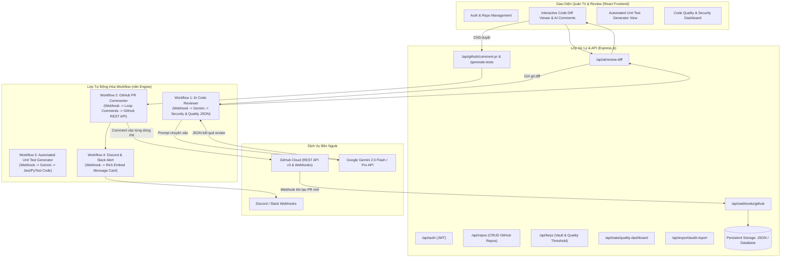
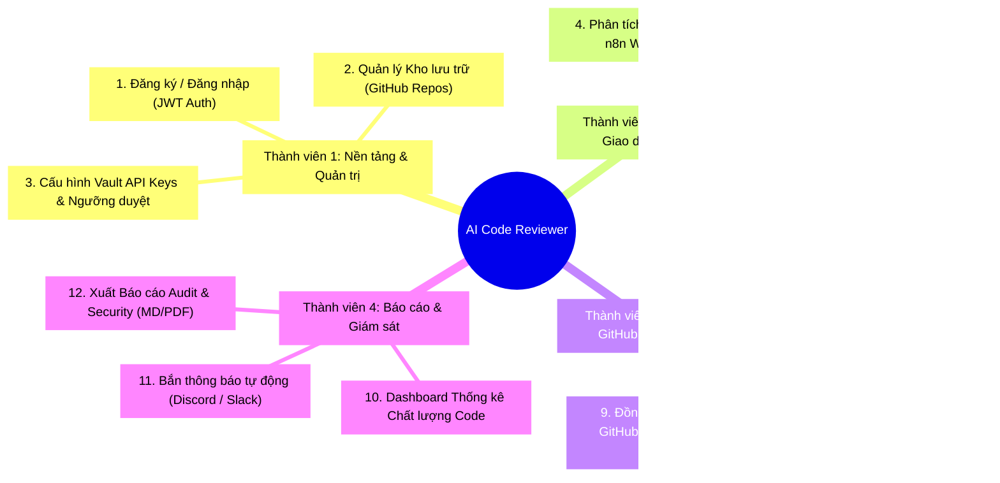

# ĐẶC TẢ KIẾN TRÚC & QUY TRÌNH HỆ THỐNG
# ĐỀ TÀI: AI-POWERED CODE REVIEWER & AUTOMATED PR QUALITY GATE
## CHỦ ĐỀ CHUNG: SOFTWARE ENGINEERING AUTOMATION (16)

> **Dành cho nhóm 4 thành viên.**  
> Đề tài giải quyết bài toán tự động hóa kiểm thử tĩnh, rà soát lỗ hổng bảo mật (Security Vulnerabilities), chấm điểm chất lượng mã nguồn (Code Quality Score) và tự động tương tác với GitHub Pull Request thông qua n8n Workflow Automation.

---

## 1. TỔNG QUAN HỆ THỐNG

Hệ thống hoạt động theo mô hình **Automated Quality Gate**:
1. **Developer đẩy code**: Tạo Pull Request (PR) trên GitHub.
2. **GitHub Webhook kích hoạt n8n**: Gửi gói tin `git diff` sang n8n Webhook.
3. **n8n & Gemini AI Engine**:
   - Quét mã nguồn, phát hiện lỗi bảo mật (SQL Injection, XSS, rò rỉ secret token, memory leak, code smell).
   - Chấm điểm chất lượng code (0 - 100 điểm, xếp loại A, B, C, D).
   - Tự động sinh mã kiểm thử Unit Test (Jest/PyTest).
   - Tự động comment nhận xét vào từng dòng code trên GitHub PR.
4. **React Frontend Web**:
   - Giao diện Diff Viewer chuyên nghiệp hiển thị song song code cũ / code mới.
   - Cho phép con người (Tech Lead) chỉnh sửa, duyệt nhận xét trước khi gửi (Human-in-the-loop).
   - Dashboard biểu đồ chất lượng code và bảng xếp hạng Clean Code trong team.
   - Bắn thông báo kết quả vào Discord / Slack.

---

## 2. PHÂN CHIA 12 LUỒNG CHO 4 THÀNH VIÊN

---

## 3. CHI TIẾT 12 LUỒNG THI CÔNG

### THÀNH VIÊN 1: NỀN TẢNG, AUTH & KHO LƯU TRỮ
* **Luồng 1 (JWT Auth)**: Xác thực lập trình viên, mã hóa bcrypt mật khẩu, cấp JWT token để bảo vệ toàn bộ API backend.
* **Luồng 2 (Quản lý Repositories)**: Thêm/sửa/xóa các kho GitHub cần giám sát (ví dụ: `facebook/react`, `owner/my-backend`), cấu hình nhánh mặc định (`main`, `dev`) và ngôn ngữ lập trình.
* **Luồng 3 (API Keys Vault & Quality Gate Policy)**: Nhập và mã hóa GitHub Personal Access Token (PAT), Google Gemini API Key, cấu hình điều kiện chặn Merge (ví dụ: Điểm code dưới 80 thì không cho merge, cấm tuyệt đối lỗi `CRITICAL_SECURITY`). Có nút Test Connection trực tiếp.

### THÀNH VIÊN 2: CORE AI & GIAO DIỆN REVIEW CODE
* **Luồng 4 (Core AI Review qua n8n Webhook)**: Nhận `git diff`, n8n gọi Gemini AI phân loại lỗi theo 4 nhóm:
  1. 🔴 **Bảo mật (Security)**: SQL Injection, XSS, Hardcoded Secrets, Insecure Hash.
  2. 🟡 **Hiệu năng (Performance)**: N+1 query, rò rỉ bộ nhớ, vòng lặp lồng vô tận.
  3. 🔵 **Clean Code**: Code trùng lặp, biến đặt tên vô nghĩa, hàm quá dài.
  4. 🟢 **Đề xuất sửa đổi (Refactored Code)**: Đoạn code tối ưu thay thế.
* **Luồng 5 (Giao diện Review Diff trực quan)**: Render bảng diff code chuyên nghiệp (màu đỏ `-` dòng bị xóa, màu xanh `+` dòng thêm mới), các nhận xét của AI được gắn badge và ghim trực tiếp dưới dòng code vi phạm.
* **Luồng 6 (Human-in-the-loop Edit & Validate)**: Cho phép Tech Lead chấp nhận (Accept fix), bỏ qua (Dismiss) hoặc thêm ghi chú thủ công trước khi chốt gửi lên GitHub.

### THÀNH VIÊN 3: TỰ ĐỘNG HÓA GITHUB & WEBHOOK ENGINE
* **Luồng 7 (Tự động Comment PR trên GitHub)**: n8n duyệt danh sách nhận xét đã được duyệt, gọi GitHub REST API (`POST /repos/{owner}/{repo}/pulls/{number}/reviews` hoặc `/issues/{number}/comments`) để post comment trực tiếp lên GitHub thật.
* **Luồng 8 (Sinh Unit Test tự động)**: Gọi n8n AI sinh tự động file mã kiểm thử (Jest / PyTest) tương ứng với các hàm vừa thay đổi trong PR, có nút copy và tải về file `.test.js`.
* **Luồng 9 (Lắng nghe GitHub Webhook)**: Endpoint Express `POST /api/webhooks/github` tiếp nhận sự kiện khi lập trình viên mở PR trên GitHub (`pull_request.opened`), tự động kích hoạt tiến trình review ngầm. Có widget giả lập sự kiện GitHub Webhook để demo 1-click.

### THÀNH VIÊN 4: BÁO CÁO, DASHBOARD & THÔNG BÁO
* **Luồng 10 (Dashboard Chất lượng Code)**: Biểu đồ điểm chất lượng code (A/B/C/D), tỷ lệ lỗi bảo mật, bảng xếp hạng lập trình viên có tỷ lệ code sạch nhất (Clean Code Leaderboard).
* **Luồng 11 (Bắn thông báo tự động Discord / Slack)**: n8n tự động format Rich Card báo cáo kết quả review (Điểm số, số lỗi bảo mật, link PR) bắn vào kênh chat team.
* **Luồng 12 (Xuất Báo cáo Audit)**: Xuất toàn bộ báo cáo phân tích bảo mật ra định dạng Markdown (`.md`) hoặc PDF in ấn phục vụ kiểm thử và nghiệm thu phần mềm.
