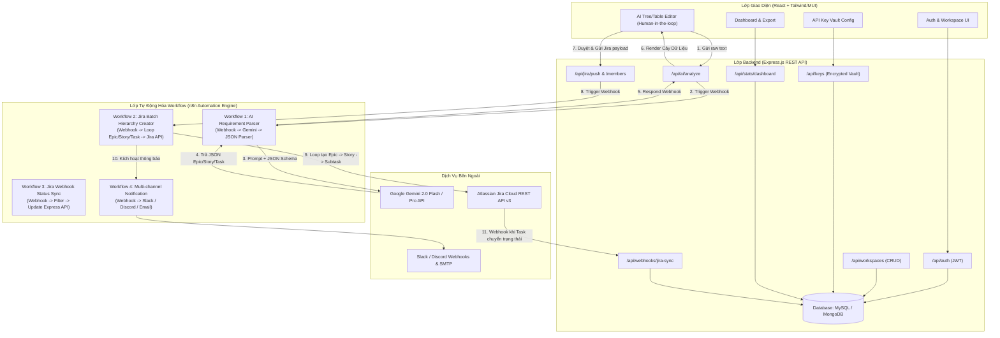
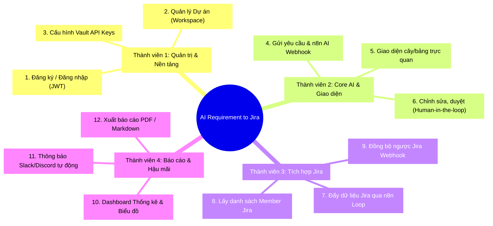
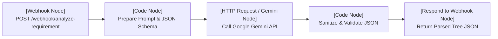
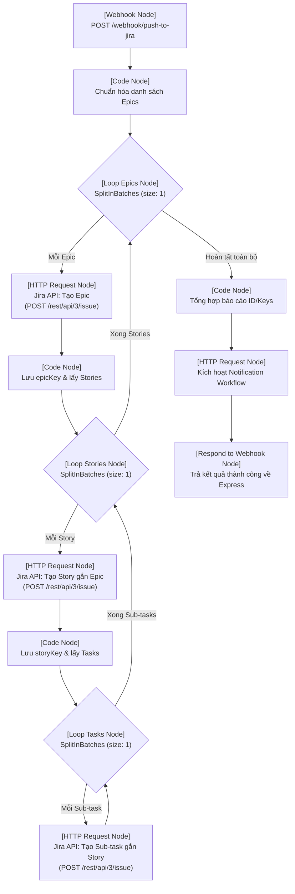
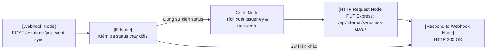
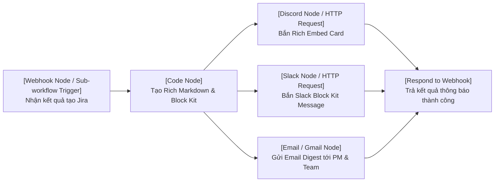

# TÀI LIỆU ĐẶC TẢ KIẾN TRÚC & QUY TRÌNH N8N WORKFLOW
## DỰ ÁN: AI REQUIREMENT-TO-JIRA AGENT

> **Dành cho 4 thành viên nhóm phát triển.**  
> Tài liệu này chuẩn hóa toàn bộ 12 luồng tính năng, luồng giao tiếp giữa React <-> Express <-> n8n <-> Gemini / Jira, và sơ đồ trực quan từng Node trên n8n canvas.

---

## 1. TỔNG QUAN HỆ THỐNG & SƠ ĐỒ TỔNG THỂ

Hệ thống kết hợp giữa **Web Application** và **Workflow Automation (n8n)**:
- **Frontend (React)**: Nhập yêu cầu, xem trước cây dữ liệu, chỉnh sửa (Human-in-the-loop), theo dõi dashboard.
- **Backend (Express.js)**: Xác thực JWT, quản lý cơ sở dữ liệu, quản lý API Keys vault, chuyển tiếp request đến n8n Webhook.
- **n8n Automation Engine**: Xử lý logic gọi AI (Gemini), vòng lặp bóc tách tạo Jira (Epic -> Story -> Subtask), bắn webhook thông báo.
- **Dịch vụ ngoài**: Google Gemini 2.0 Flash API, Atlassian Jira Cloud REST API v3, Discord/Slack Webhook.



---

## 2. PHÂN CHIA 12 LUỒNG CHO 4 THÀNH VIÊN



---

## 3. THIẾT KẾ CÁC SƠ ĐỒ WORKFLOW TRÊN N8N KÈM WEBHOOK

### WORKFLOW 1: BÓC TÁCH YÊU CẦU NGHIỆP VỤ BẰNG AI (LUỒNG 4 - THÀNH VIÊN 2)

**Mục tiêu**: Nhận đoạn text yêu cầu nghiệp vụ, gọi Gemini AI với prompt cấu trúc nghiêm ngặt, parse JSON và trả về cây Epic -> Story -> Sub-task.

#### Sơ đồ Canvas các Node trên n8n:


#### Chi tiết thiết lập từng Node trên n8n:
1. **Node 1: Webhook Trigger**:
   - HTTP Method: `POST`
   - Path: `analyze-requirement`
   - Response Mode: `Using 'Respond to Webhook' Node`
2. **Node 2: Code Node (Xây dựng Prompt)**:
   - Nhận payload từ Webhook: `{ requirementText, projectKey, geminiApiKey }`
   - Gắn prompt ép AI trả về schema:
     ```json
     {
       "epics": [
         {
           "summary": "Tên Epic",
           "description": "Mô tả",
           "stories": [
             {
               "summary": "Tên Story",
               "description": "As a... I want... So that...",
               "storyPoints": 3,
               "priority": "High",
               "tasks": [
                 { "summary": "Tên Sub-task", "estimatedHours": 4 }
               ]
             }
           ]
         }
       ]
     }
     ```
3. **Node 3: HTTP Request (Gemini API)**:
   - Endpoint: `https://generativelanguage.googleapis.com/v1beta/models/gemini-2.0-flash:generateContent?key={{$json.geminiApiKey}}`
   - Body: JSON prompt với `temperature: 0.2`, `responseMimeType: "application/json"`.
4. **Node 4: Code Node (Làm sạch & parse JSON)**:
   - Loại bỏ markdown backticks (nếu có), validate cú pháp JSON.
5. **Node 5: Respond to Webhook**:
   - HTTP Status 200, trả dữ liệu JSON về cho Express.

---

### WORKFLOW 2: TỰ ĐỘNG TẠO HIERARCHY TRÊN JIRA (LUỒNG 7 - THÀNH VIÊN 3)

**Mục tiêu**: Nhận cây dữ liệu Epic/Story/Sub-task đã được duyệt, dùng Loop node tạo lần lượt trên Jira Cloud và liên kết quan hệ cha-con chính xác.

#### Sơ đồ Canvas các Node trên n8n:


#### Chi tiết gọi Jira REST API v3:
- **Tạo Epic**: `POST https://{domain}/rest/api/3/issue` với `issuetype: { name: "Epic" }`. Nhận về `epicKey` (vd: `PROJ-101`).
- **Tạo Story**: `POST https://{domain}/rest/api/3/issue` với `issuetype: { name: "Story" }`, gắn `parent: { key: epicKey }`. Nhận về `storyKey`.
- **Tạo Sub-task**: `POST https://{domain}/rest/api/3/issue` với `issuetype: { name: "Sub-task" }`, gắn `parent: { key: storyKey }`.

---

### WORKFLOW 3: ĐỒNG BỘ TRẠNG THÁI NGƯỢC TỪ JIRA WEBHOOK (LUỒNG 9 - THÀNH VIÊN 3)

**Mục tiêu**: Lắng nghe sự kiện từ Jira khi Dev kéo task sang "Done", tự động đồng bộ vào Database của website.

#### Sơ đồ Canvas các Node trên n8n:


---

### WORKFLOW 4: THÔNG BÁO TỰ ĐỘNG ĐA KÊNH DISCORD / SLACK (LUỒNG 11 - THÀNH VIÊN 4)

**Mục tiêu**: Bắn thông báo đẹp mắt vào Discord và Slack khi một đợt tạo Epic/Task thành công.

#### Sơ đồ Canvas các Node trên n8n:


---

## 4. CHI TIẾT CÁC ENDPOINT API CỦA EXPRESS (BACKEND)

### Nhóm Auth & Workspace (Thành viên 1)
- `POST /api/auth/register`: Đăng ký tài khoản mới.
- `POST /api/auth/login`: Đăng nhập, trả về JWT Token.
- `GET /api/workspaces`: Lấy danh sách workspace người dùng sở hữu.
- `POST /api/workspaces`: Tạo workspace mới.
- `POST /api/keys/save`: Lưu và mã hóa Jira Domain, Token và Gemini Key.

### Nhóm AI Processing (Thành viên 2)
- `POST /api/ai/analyze`: Nhận yêu cầu thô từ React, lấy key từ DB và chuyển tiếp đến n8n Webhook `/webhook/analyze-requirement`.

### Nhóm Jira Integration (Thành viên 3)
- `POST /api/jira/push`: Nhận cấu trúc Story/Task sau khi người dùng chỉnh sửa, gọi n8n Webhook `/webhook/push-to-jira`.
- `GET /api/jira/members?project=PROJ`: Lấy danh sách thành viên trong project Jira để người dùng assign việc trực tiếp.
- `POST /api/webhooks/jira-sync`: Tiếp nhận webhook đồng bộ trạng thái ngược từ Jira.

### Nhóm Dashboard & Report (Thành viên 4)
- `GET /api/stats/dashboard`: Lấy các chỉ số thống kê (số Epic, số Story, tỷ lệ hoàn thành, thời gian xử lý AI).
- `GET /api/export/markdown/:sessionId`: Xuất file Markdown.
- `GET /api/export/pdf/:sessionId`: Xuất file PDF.

---

## 5. CHECKLIST TRIỂN KHAI CHO TỪNG THÀNH VIÊN

- [ ] **Thành viên 1**: Cài đặt JWT, thiết kế bảng User/Workspace/ApiConfig, viết API CRUD Workspace và Vault mã hóa API Key.
- [ ] **Thành viên 2**: Tạo giao diện React nhập yêu cầu, dựng Node n8n cho Flow 4 (Gemini), dựng giao diện Cây phân cấp (Tree/Table) với hiệu ứng Tailwind/MUI, chức năng Thêm/Sửa/Xóa inline.
- [ ] **Thành viên 3**: Dựng Node n8n cho Flow 7 (Vòng lặp tạo Epic -> Story -> Subtask trên Jira), viết API lấy member Jira, cấu hình webhook đồng bộ ngược (Flow 9).
- [ ] **Thành viên 4**: Dựng trang Dashboard hiển thị biểu đồ phân bố Story Points / Task count, thiết lập Node n8n Flow 11 (Discord / Slack notification), viết tính năng xuất PDF / Markdown (Flow 12).
